# 1. 二分查找

要求：在有序数组A内，查找值target

- 如果找到返回索引
- 如果找不到返回 -1

算法描述：

前提：给定一个内含n个元素的有序数组A，满足A0<=A1<=A2<=.....<=An-1一个待查值target

1、设置 i = 0, j = n-1

2、如果 i > j,结束查找，没找到

3、设置 m = floor ((i+j)/2)，m为中间索引，floor是向下取整（小于等于（i+j）/2的最小整数）

4、如果target < Am设置 j=m-1，跳到第二步

5、如果Am < target设置 i = m + 1，跳到第二步

6、如果Am = target，结束查找，找到了

代码实现：

a表示待查找的升序数组，target表示待查找的目标

找到返回索引，找不到返回-1

```java
public static int binarySearchBasic(int[] a, int target) {
    int i = 0, j = a.length - 1;   //设置指针和初值
    while(i <= j){                //i~j范围内有东西
        int m = (i + j) >>> 1;    
        if(target < a[m]){        //目标在左边
            j = m - 1;
        }else if(a[m] < target){  //目标在右边
            i = m + 1;
        }else{                    //找到了
            return m;
        }
    }
    return -1;
}
```

注意：

1、为什么是 i<=j 意味着区间内有未比较的元素，而不用 i<j 呢？

答：i==j 意味着i，j 他们指向的元素也会参与比较，i<j 只意味着 m 指向的元素参与比较

2、为什么要用（i+j）>>> 1，而不是（i+j）/2 呢?

说明：>>>1 无符号右移一位 可以看作是 除以2向下取整

答：因为如果数组元素个数非常多，i+j的结果超出了java最大正整数表示范围就会显示为负数，而数组的索引不能是负数，所以只能用无符号右移运算符，在java中，总是把一个二进制数的最高位视为符号位，如果最高位为1，那么这个二进制数表示的数为负数


```java
public static int binarySearchAlternative(int[] a, int target) {
    int i = 0, j = a.length;   //设置指针和初值，改动处
    while(i < j){                //i~j范围内有东西，改动处
        int m = (i + j) >>> 1;    
        if(target < a[m]){        //目标在左边
            j = m;                //改动处
        }else if(a[m] < target){  //目标在右边
            i = m + 1;
        }else{                    //找到了
            return m;
        }
    }
    return -1;
}
```

说明：改动之后的 j （初始的j）只是作为一个边界值并没有指向查找目标，而改动之前的 j 是直接指向最后一个数组元素，对比查找的值是要把 j 算在内的

所以改动之前的 i 和 j 可以称作左闭右闭边界，改动之后的 i 和 j 称作左闭右开边界


```java
//a可以是无序数组
public static int linearSearch(int[] a, int target){
    for (int i = 0; i<a.length;i++){
        if (a[i] == target){
            return i;
     }
  }
    return -1;
}
```


怎么比较两个算法的优劣呢？可以比较两个算法的时间复杂度和空间复杂度

在计算机科学中，时间复杂度是用来衡量：一个算法的执行，随着数据规模的增大而增长的时间成本

时间复杂度不依赖于环境因素

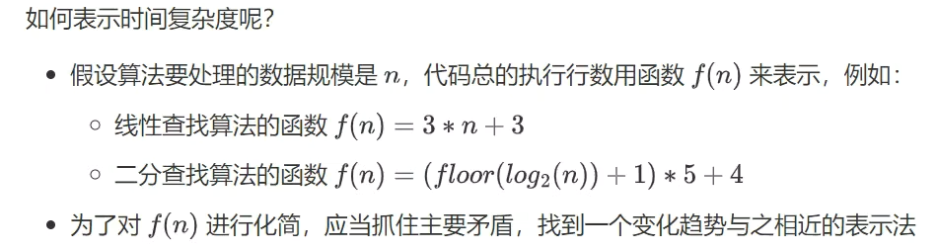

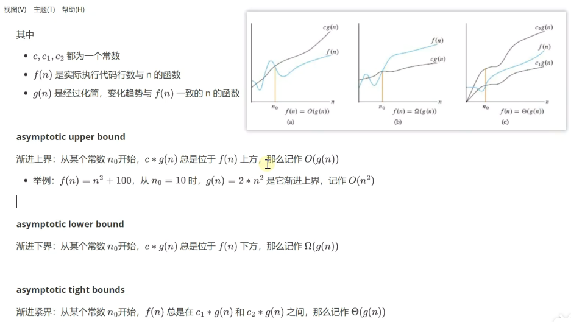

说明：渐进上界中的g(n)可以代表算法的最好情况 （大O表示法）

​          渐进下界的g(n)可以代表算法的最坏情况（欧米伽表示法）

​          渐进紧界的g(n)既能代表算法的最好也能代表算法的最坏情况（θ表示法）

常见的表示法一般用大O表示法

大O表示法的解析：

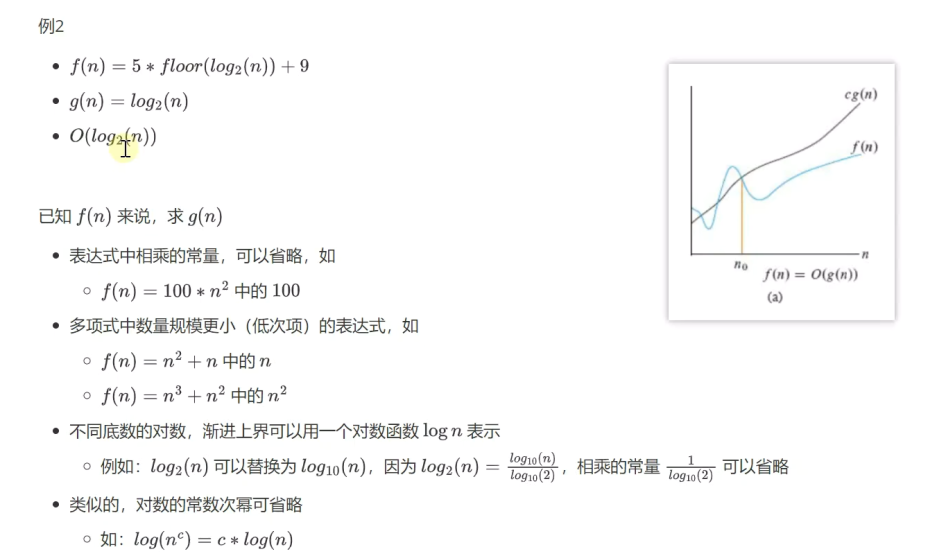

常见的大O表示法：

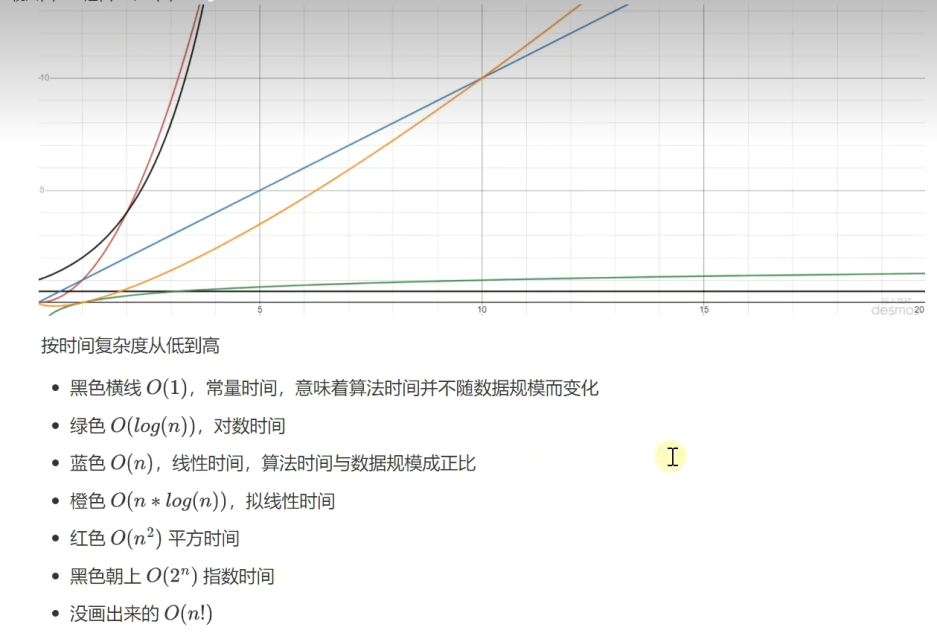

空间复杂度：

与时间复杂度类似，一般也用大O表示法来衡量：一个算法执行随数据规模增大，而增长的额外空间成本

二分查找的性能

分析：

时间复杂度

- 最坏情况：O(log(n))
- 最好情况：如果待查找元素恰好在数组中央，只需要循环一次O(1)

空间复杂度

- 需要常数个指针i，j，m，因此额外占用的空间是O(1)


```java
public static int binarySearch3(int[] a, int target){
    int i = 0, j = a.length;
    while(1 < j - i){
        int m = ( i + j ) >>> 1;
        if(target < a[m]){
            j = m;
        }else{
            i = m;
        }
    }
    if(a[i] == target){
        return i;
    }else{
        return -1;
    }
}
```

优点：循环内的平均比较次数减少了

缺点：时间复杂度变为了θ(log(n))


在java中，可以通过Arrays找到二分查找的源代码，要使用的话就直接调用

```java
@Test
public void test(){
    int[] a = {2, 5, 8};
    int target = 4;
    int i = Arrays.binarySearch(a, target);
    if(i < 0){
        int insertIndex = Math.abs(i+1);//插入点索引，用Math.abs函数取绝对值
        int[] b = new int[a.length + 1];
        System.arraycopy(a, 0, b, 0, insertIndex);
        b[insertIndex] = target;
        System.arraycopy(a, insertIndex, b, insertIndex + 1, a.length - insertIndex);
    }
}
```

查找最左侧重复元素

```java
public static int binarySearchLeftmost1(int[] a, int target){
    int i = 0, j = a.length - 1;
    int candidate = -1;
    while(i <= j){                
        int m = (i + j) >>> 1;    
        if(target < a[m]){        
            j = m - 1;
        }else if(a[m] < target){  
            i = m + 1;
        }else{                  
            candidate = m; //记录后选位置
            j = m - 1;
        }
    }
    return candidate;
}
```

查找最右侧重复元素其实跟最左侧的代码基本一致：只需把else里的条件j = m - 1改为j = m + 1即可，这里就不写了


查找>=target的最靠左的索引位置

```java
public static int binarySearchLeftmost2(int[] a, int target){
    int i = 0, j = a.length - 1;
    while (i <= j){
        int m = (i + j) >>> 1;
        if(target <= a[m]){
            j = m - 1;
        }else{
            i = m + 1;
        }
    }
    return i;
}
```

查找<=target的最靠右的索引位置

```java
public static int binarySearchRightmost2(int[] a, int target){
    int i = 0, j = a.length - 1;
    while (i <= j){
        int m = (i + j) >>> 1;
        if(target < a[m]){
            j = m - 1;
        }else{
            i = m + 1;
        }
    }
    return i - 1;
}
```

查找最左、最右索引位置的应用：

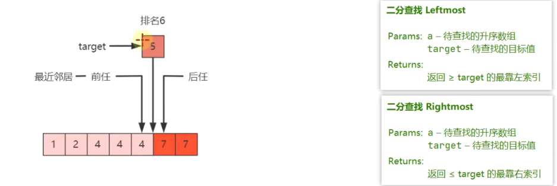

排名：指查找的值target在这组数中排第几

前任：指比target小的更靠右的

后任：指比target大的更靠左的

最近邻居：指前任和后任中离target近的

求排名：排名=leftmost（target）+ 1

求前任：leftmost（target）- 1

求后任：rightmost（target）+ 1

求最近邻居就是把前任和后任都求出来在进行比较哪个更近就是哪个

范围查询：指找某个数组内<或者>或者=target值的范围

力扣题：

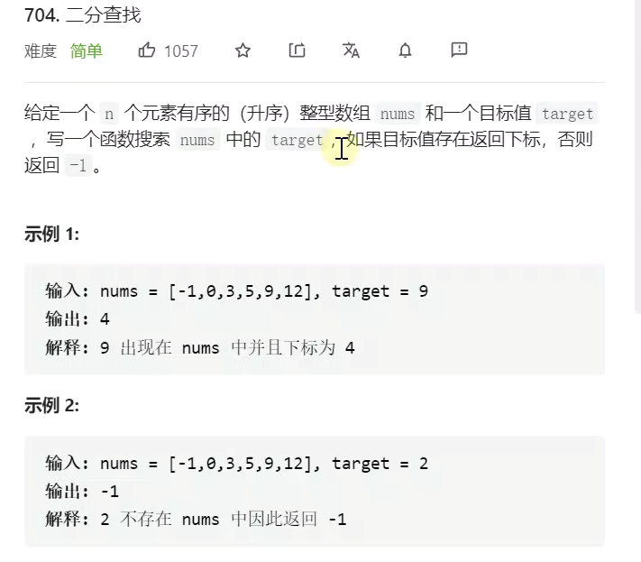

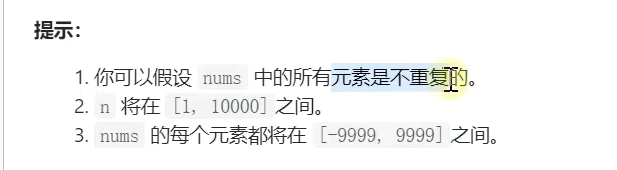

示例：

```java
class Solution{
    public int search(int[] nums, int target){
        int i = 0, j = nums.length - 1;
        while(i <= j){
            int m = (i + j) >>> 1;
            if(target < nums[m]){
                j = m - 1;
            }else if(nums[m]<target){
                i = m + 1;
            }else{
                return m;
            }
        }
        return -1;
    }
}
```

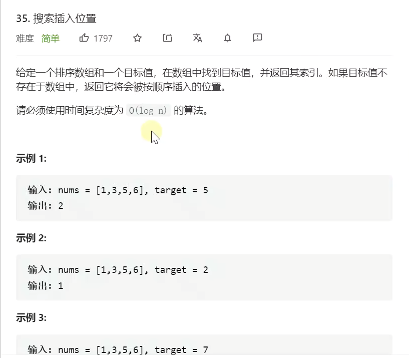

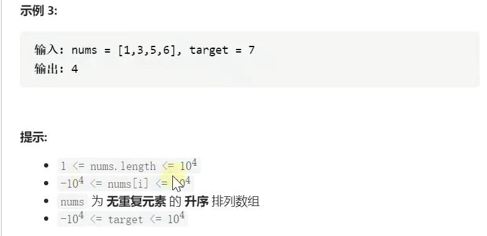

```java
class Solution{
    public int search(int[] nums, int target){
        int low = 0;
        int high = nums.length - 1;
        while(low <= high){
            int m = (low + high) >>> 1;
            long M = nums[m];
            if(M < target){
                low = m + 1;
            }else if(target < M){
                high = m - 1;
            }else{
                return m;
            }
        }
        return low;
    }
}
```

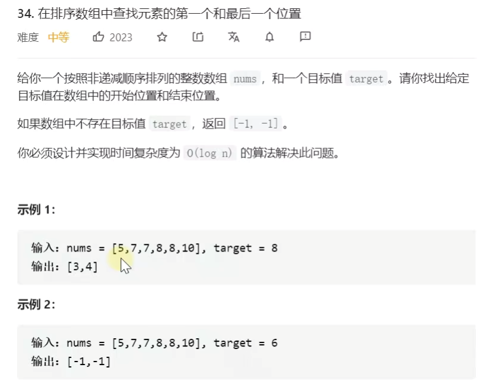

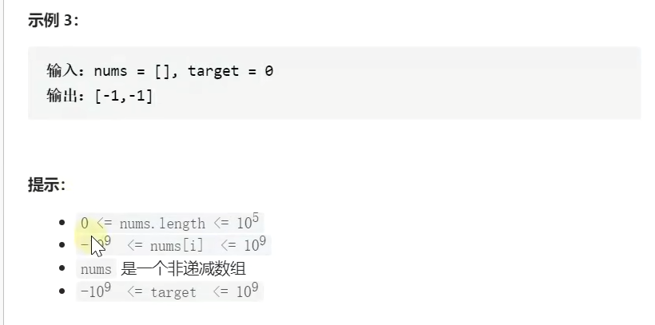

```java
class Solution{
    public int[] searchRange(int[] nums, int target){
        int x = left(nums, target);
        if(x == -1){
            return new int[]{-1,-1};
        }else{
            return new int[]{x,right(a, target)};
        }
    }
    public int left(int[] a,int target){
        int i = 0,j = a.length - 1;
        int candidate = -1;
        while(i <= j){
            int m = (i+j) >>> 1;
            if(target < a[m]){
                j = m - 1;
            }else if(a[m] < target){
                i = m + 1;
            }else{
                candidate = m;
                j = m - 1;
            }
        }
        return candidate;
    }
    public int right(int[] a,int target){
        int i = 0,j = a.length - 1;
        int candidate = -1;
        while(i <= j){
            int m = (i+j) >>> 1;
            if(target < a[m]){
                j = m - 1;
            }else if(a[m] < target){
                i = m + 1;
            }else{
                candidate = m;
                i = m + 1;
            }
        }
        return candidate;
    }
}
```