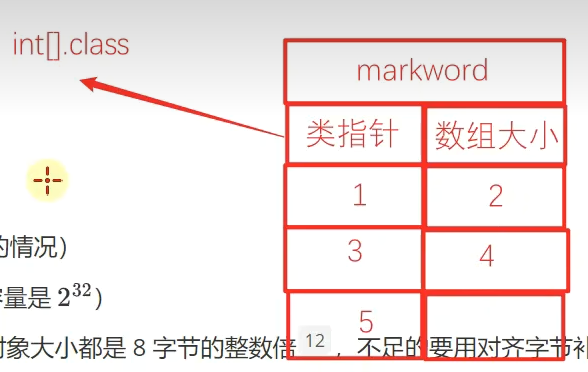
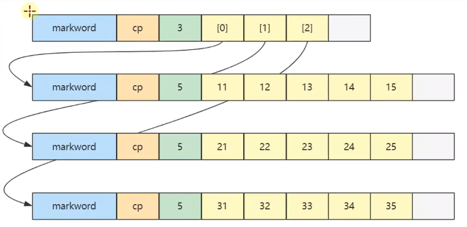
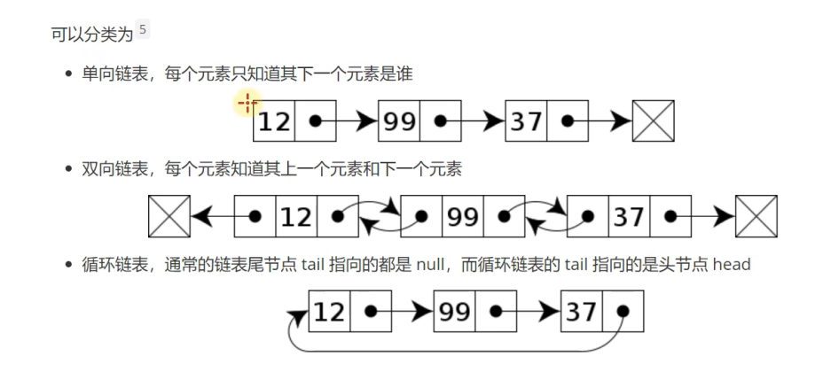
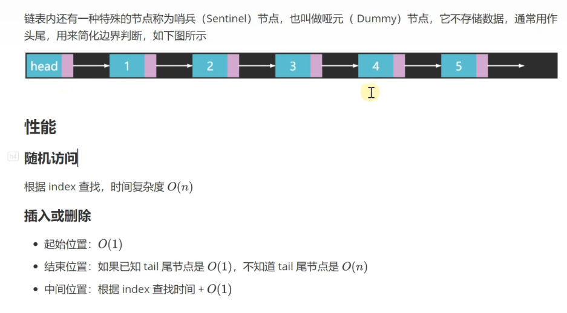
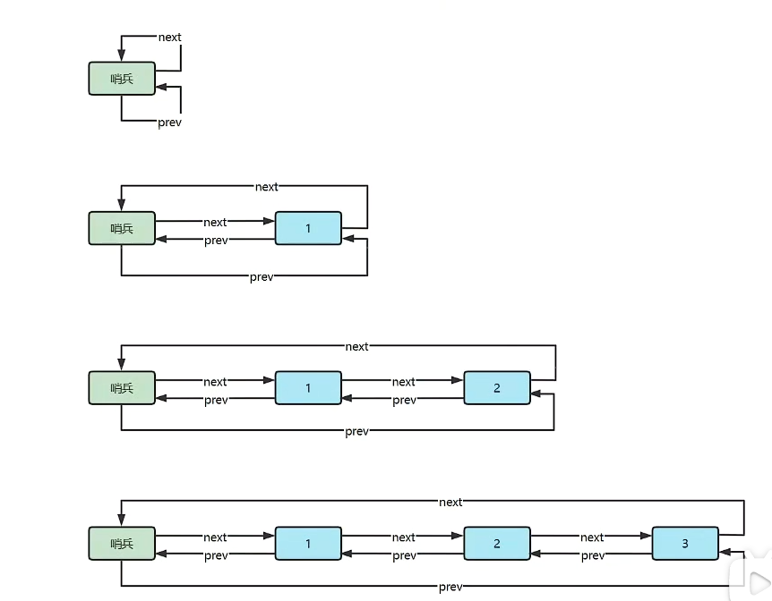
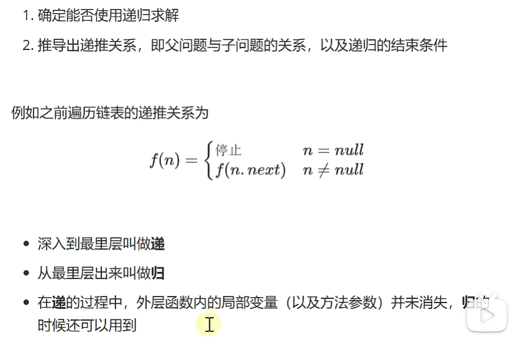
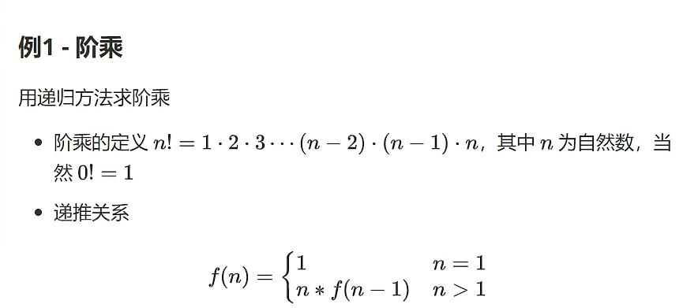
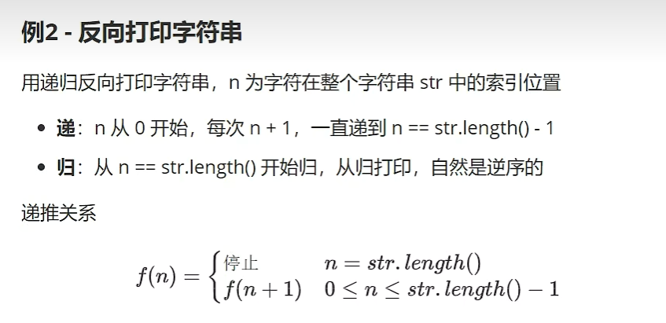

# 1. 二分查找

要求：在有序数组A内，查找值target

- 如果找到返回索引
- 如果找不到返回 -1

算法描述：

前提：给定一个内含n个元素的有序数组A，满足A0<=A1<=A2<=.....<=An-1一个待查值target

1、设置 i = 0, j = n-1

2、如果 i > j,结束查找，没找到

3、设置 m = floor ((i+j)/2)，m为中间索引，floor是向下取整（小于等于（i+j）/2的最小整数）

4、如果target < Am设置 j=m-1，跳到第二步

5、如果Am < target设置 i = m + 1，跳到第二步

6、如果Am = target，结束查找，找到了

代码实现：

a表示待查找的升序数组，target表示待查找的目标

找到返回索引，找不到返回-1

```java
public static int binarySearchBasic(int[] a, int target) {
    int i = 0, j = a.length - 1;   //设置指针和初值
    while(i <= j){                //i~j范围内有东西
        int m = (i + j) >>> 1;    
        if(target < a[m]){        //目标在左边
            j = m - 1;
        }else if(a[m] < target){  //目标在右边
            i = m + 1;
        }else{                    //找到了
            return m;
        }
    }
    return -1;
}
```

注意：

1、为什么是 i<=j 意味着区间内有未比较的元素，而不用 i<j 呢？

答：i==j 意味着i，j 他们指向的元素也会参与比较，i<j 只意味着 m 指向的元素参与比较

2、为什么要用（i+j）>>> 1，而不是（i+j）/2 呢?

说明：>>>1 无符号右移一位 可以看作是 除以2向下取整

答：因为如果数组元素个数非常多，i+j的结果超出了java最大正整数表示范围就会显示为负数，而数组的索引不能是负数，所以只能用无符号右移运算符，在java中，总是把一个二进制数的最高位视为符号位，如果最高位为1，那么这个二进制数表示的数为负数


```java
public static int binarySearchAlternative(int[] a, int target) {
    int i = 0, j = a.length;   //设置指针和初值，改动处
    while(i < j){                //i~j范围内有东西，改动处
        int m = (i + j) >>> 1;    
        if(target < a[m]){        //目标在左边
            j = m;                //改动处
        }else if(a[m] < target){  //目标在右边
            i = m + 1;
        }else{                    //找到了
            return m;
        }
    }
    return -1;
}
```

说明：改动之后的 j （初始的j）只是作为一个边界值并没有指向查找目标，而改动之前的 j 是直接指向最后一个数组元素，对比查找的值是要把 j 算在内的

所以改动之前的 i 和 j 可以称作左闭右闭边界，改动之后的 i 和 j 称作左闭右开边界


```java
//a可以是无序数组
public static int linearSearch(int[] a, int target){
    for (int i = 0; i<a.length;i++){
        if (a[i] == target){
            return i;
     }
  }
    return -1;
}
```


怎么比较两个算法的优劣呢？可以比较两个算法的时间复杂度和空间复杂度

在计算机科学中，时间复杂度是用来衡量：一个算法的执行，随着数据规模的增大而增长的时间成本

时间复杂度不依赖于环境因素


说明：渐进上界中的g(n)可以代表算法的最好情况 （大O表示法）

​          渐进下界的g(n)可以代表算法的最坏情况（欧米伽表示法）

​          渐进紧界的g(n)既能代表算法的最好也能代表算法的最坏情况（θ表示法）

常见的表示法一般用大O表示法

大O表示法的解析：


常见的大O表示法：


空间复杂度：

与时间复杂度类似，一般也用大O表示法来衡量：一个算法执行随数据规模增大，而增长的额外空间成本

二分查找的性能

分析：

时间复杂度

- 最坏情况：O(log(n))
- 最好情况：如果待查找元素恰好在数组中央，只需要循环一次O(1)

空间复杂度

- 需要常数个指针i，j，m，因此额外占用的空间是O(1)


```java
public static int binarySearch3(int[] a, int target){
    int i = 0, j = a.length;
    while(1 < j - i){
        int m = ( i + j ) >>> 1;
        if(target < a[m]){
            j = m;
        }else{
            i = m;
        }
    }
    if(a[i] == target){
        return i;
    }else{
        return -1;
    }
}
```

优点：循环内的平均比较次数减少了

缺点：时间复杂度变为了θ(log(n))


在java中，可以通过Arrays找到二分查找的源代码，要使用的话就直接调用

```java
@Test
public void test(){
    int[] a = {2, 5, 8};
    int target = 4;
    int i = Arrays.binarySearch(a, target);
    if(i < 0){
        int insertIndex = Math.abs(i+1);//插入点索引，用Math.abs函数取绝对值
        int[] b = new int[a.length + 1];
        System.arraycopy(a, 0, b, 0, insertIndex);
        b[insertIndex] = target;
        System.arraycopy(a, insertIndex, b, insertIndex + 1, a.length - insertIndex);
    }
}
```

查找最左侧重复元素

```java
public static int binarySearchLeftmost1(int[] a, int target){
    int i = 0, j = a.length - 1;
    int candidate = -1;
    while(i <= j){                
        int m = (i + j) >>> 1;    
        if(target < a[m]){        
            j = m - 1;
        }else if(a[m] < target){  
            i = m + 1;
        }else{                  
            candidate = m; //记录后选位置
            j = m - 1;
        }
    }
    return candidate;
}
```

查找最右侧重复元素其实跟最左侧的代码基本一致：只需把else里的条件j = m - 1改为j = m + 1即可，这里就不写了


查找>=target的最靠左的索引位置

```java
public static int binarySearchLeftmost2(int[] a, int target){
    int i = 0, j = a.length - 1;
    while (i <= j){
        int m = (i + j) >>> 1;
        if(target <= a[m]){
            j = m - 1;
        }else{
            i = m + 1;
        }
    }
    return i;
}
```

查找<=target的最靠右的索引位置

```java
public static int binarySearchRightmost2(int[] a, int target){
    int i = 0, j = a.length - 1;
    while (i <= j){
        int m = (i + j) >>> 1;
        if(target < a[m]){
            j = m - 1;
        }else{
            i = m + 1;
        }
    }
    return i - 1;
}
```

查找最左、最右索引位置的应用：


排名：指查找的值target在这组数中排第几

前任：指比target小的更靠右的

后任：指比target大的更靠左的

最近邻居：指前任和后任中离target近的

求排名：排名=leftmost（target）+ 1

求前任：leftmost（target）- 1

求后任：rightmost（target）+ 1

求最近邻居就是把前任和后任都求出来在进行比较哪个更近就是哪个

范围查询：指找某个数组内<或者>或者=target值的范围

力扣题：


示例：

```java
class Solution{
    public int search(int[] nums, int target){
        int i = 0, j = nums.length - 1;
        while(i <= j){
            int m = (i + j) >>> 1;
            if(target < nums[m]){
                j = m - 1;
            }else if(nums[m]<target){
                i = m + 1;
            }else{
                return m;
            }
        }
        return -1;
    }
}
```


```java
class Solution{
    public int search(int[] nums, int target){
        int low = 0;
        int high = nums.length - 1;
        while(low <= high){
            int m = (low + high) >>> 1;
            long M = nums[m];
            if(M < target){
                low = m + 1;
            }else if(target < M){
                high = m - 1;
            }else{
                return m;
            }
        }
        return low;
    }
}
```


```java
class Solution{
    public int[] searchRange(int[] nums, int target){
        int x = left(nums, target);
        if(x == -1){
            return new int[]{-1,-1};
        }else{
            return new int[]{x,right(a, target)};
        }
    }
    public int left(int[] a,int target){
        int i = 0,j = a.length - 1;
        int candidate = -1;
        while(i <= j){
            int m = (i+j) >>> 1;
            if(target < a[m]){
                j = m - 1;
            }else if(a[m] < target){
                i = m + 1;
            }else{
                candidate = m;
                j = m - 1;
            }
        }
        return candidate;
    }
    public int right(int[] a,int target){
        int i = 0,j = a.length - 1;
        int candidate = -1;
        while(i <= j){
            int m = (i+j) >>> 1;
            if(target < a[m]){
                j = m - 1;
            }else if(a[m] < target){
                i = m + 1;
            }else{
                candidate = m;
                i = m + 1;
            }
        }
        return candidate;
    }
}
```

# 2. 数组

定义：

在计算机科学中，数组是由一组元素（值或者变量）组成的数据结构，每个元素有至少一个索引或键来标识。

因为数组内的元素是连续储存的，所以数组内的元素的地址可以通过其索引计算出来。例如：int【】 array = {1,2,3,4,5} 这个数组内元素的索引为0,1,2,3,4  假设0这个索引的地址为b，那么1索引的地址就是b+4, 2索引的地址为b+8，以此类推。

知道了数组的数据起始地址BaseAddress,就可以由公式 BaseAddress+i * size 计算出索引 i 元素的地址。

- i 即索引，在java、C语言都是从0开始
- size 是每个元素占用字节，例如 int 型占4个字节，double 占8个字节

小测试

byte【】array = {1,2,3,4,5}

已知array的数据的起始地址是0x7138f94c8，那么元素3的地址是什么？

根据公式得：

BaseAddress + i * size = 0x7138f94c8 + 2 * 1 = 0x7138f94c10 = 0x7138f94ca

注意：10在16进制中为a

**数组性能**

空间占用

java中数组结构为

- 字节markword
- 4字节class指针（压缩 class指针的情况）
- 4字节数组大小（决定了数组最大容量是232)
- 数组元素+对齐字节（lava中所有对象大小都是8字节的整数倍12,不足的要用对齐字节补足）

例如

 int【】array = {1, 2, 3, 4, 5} 的大小为40个字节，组成如下：

8 + 4 +4 + 5 * 4 + 4(alignment)

空间占用示意图：



随机访问

即根据索引查找元素，时间复杂度是O（1）

随机访问根数据规模没有关系

动态数组：

就是可以进行插入，删除元素，并且其大小可以根据自己的需要进行变化的数组称为动态数组，反之则为静态数组。

动态数组也支持扩容

```java
public class DynamicArray{
    private int size = 0; // size表示逻辑大小（控制数组内有效元素的个数）
    private int capacity = 8; //容量
    private int[] array = new int[capacity];//定义一个容量为8的空数组
    //private int[] array = {}; //为了节省空间初始值可以设置成没有容量的空数组
    
    //向最后位置【size】添加元素 element表示待添加的元素
    public void addLast(int element){
        array[size] = element;
        size++;
        //add1(size,element);//可以直接调用合并后的的代码实现
    }

    //向【0---size】位置添加元素 index表示索引位置 element表示待添加的元素
    public void add(int index, int element){
        //容量检查
        checkAndGrow();
        //添加逻辑
        if(index >= 0 && index < size){
            //向后挪动，空出待插入位置
            System.arraycopy(array, index, array, index+1,
                             size - index);
            array[index] = element;
            size++;
        }
    }

    //将以上两个方法合并的代码实现
    public void add1(int index, int element){
        if(index >= 0 && index < size){
            System.arraycopy(array, index, array, index+1,
                             size - index);
        }
        array[index] = element;
        size++;
    }
    //数组扩容
    private void checkAndGrow(){
        //容量检查
        if(size == 0){
            array = new int[capaity];//这个是将用到的空数组容量扩大到8，相当于上边的初始化容量为8的空数组
        }else if(size == capacity){
            //进行扩容，一般扩到原来的1.5，1.618,2倍大小
            capacity += capacity >> 1;
            int[] newArray = new int[capacity];
            System.arraycopy(array, 0, newArray, 0, size);
            array = newArray;
        }
    }

    //删除元素
    public int remove(int index){
        int removed = array[index];
        if(index < size - 1){
            System,arraycopy(array, index + 1, array, index,
                             size - index - 1);
        }
        size--;
        return removed;
    }

    //查询元素
    public int get(int index){
        return array[index];//返回该索引位置的元素
    }

    //遍历方法1
    //为了不把遍历方法写死，而是把它作为参数传递进来以便于后续的操作
    //例如：将数据传入到数据库中
    //在java中传入一个consumer的函数式接口作为参数
    public void forEach(Consumer<Integer> consumer){
        for (int i = 0; i < size; i++){
            //consumer能够实现这两个条件：提供array【i】，返回void
            consumer.accept(array[i]);
        }
    }
}
public class DynamicArray implements Interable<Integer>{
    //遍历方法2 迭代器遍历
    @Override
    public Iterator<Integer> iterator(){
        return new Iterator<Integer>(){
            int i = 0;
            @Override
            public boolean hasNext(){//有没有下一个元素
                return i < size;
            }

            @Override
            public Integer next(){//返回当前元素，并移动到下一个元素
                return array[i++];
            }
        }
    }

    //遍历方法3 Stream流遍历
    public IntStream stream(){
        return IntStream.of(Arrays.copyOfRange(array, 0, size));
    }
}
```

插入或删除性能

头部位置，时间复杂度是O(n)

中间位置，时间复杂度是O(n)

尾部位置，时间复杂度是O(1)(均摊来说)


二维数组

例：int【】【】 array = { 

{11,12,13,14,15},

{21,22,23,24,25},

{31,32,33,34,35}, 

​     };

内存图如下：



- 二维数组占32个字节，其中array【0】，array【1】，array【2】三个元素分别保存了指向三个一维数组的引用
- 三个一维数组各占40个字节
- 它们在内层布局上是连续的

怎么定位二维数组内的元素？

比如：要找上边那个数组中的25元素，它怎么表示呢？

答：array[i][j] = array[2][4] 其中 i = 外层数组索引位置，j = 内层数组索引位置 

遍历二维数组中

先循环行，再循环列的代码实现效率高

局部性原理

这里只讨论空间局部性

- CPU读取内存（速度慢）数据后，会将其放入高速缓存（速度快）当中，如果后来的计算再用到此数据，在缓存中能读到的话，就不必读内存了
- 缓存的最小储存单位是缓存行，一般是64bytes，一次读的数据少了不划算，因此最少读取64bytes填满一个缓存行，所以读取某个数据时也会读取其临近的数据，这就是所谓的空间局部性

# 3. 链表

定义

在计算机科学中，链表是数据元素的线性集合，其每个元素都指向下一个元素，元素储存上并不连续。

分类：





```java
public class SinglyLinkedList{//整体
    private Node head = null;//头指针
    //节点类
    private static class Node{
        int value;// 值
        Node next; // 下一个节点指针
        public Node(int value, Node next){
            this.value = value;
            this.next = next;
        }
    }

    //向链表头部添加 添加值为 value
    public void addFirst(int value){
        //1.链表为空
        head = new Node(value, null);
        //2.链表非空
        head = new Node(value，head);
    }

    //遍历链表
    public void loop(){
        Node p = head;
        while(p != null){
            System.out.println(p.value);
            p = p.next;
        }
    }
    //改动版，不写死
    public void loop1(Consumer<Integer> consumer){
        Node p = head;
        while(p != null){
            consumer.accept(p.value);
            p = p.next;
        }
    }

    //用for循环遍历
    public void loop2(Consumer<Integer> consumer){
        for(Node p = head; p != null; p = p.next){
            consumer.accept(p.value);
        }
    }
    
    //递归遍历
    public void loop3(Consumer<Integer> before,
                      Consumer<Integer> after){
        recursion(head, before, after);
    }
    private void recursion(Node curr,Consumer<Integer> before,
                          Consumer<Integer> after){//某个节点要进行的操作
        if(curr == null){
            return;
        }
        before.accept(curr.avlue);//输出值在递归之前和之后的顺序是不一样的
        recursion(curr.next, before, after);
        after.accept(curr.avlue);
    }

    //向链表尾部添加
    private Node findLast(){
        if(head == null){//空链表
            return null;
        }
        Node p;
        for(p = head; p.next != null; p = p.next){
            
        }
        return p;
    }
    public void addLast(int value){
        Node last = findLast();
        if(last == null){
            addFirst(value);
            return;
        }
        last.next = new Node(value, null);
    }

    //根据索引查找 
    //找到就返回该索引位置节点的值，找不到就抛出index非法异常
    private Node findNode(int index){
        int i = 0;
        for(Node p = head; p != null; p = p.next, i++){
            if(i == index){
                return p;
            }
        }
        return null; //没找到
    }
    public int get(int index){
        Node node = findNode(index);
        if(node == null){
            throw new IllegalArgumentException(String.format(
                "index [%d] 不合法%n", idnex));
        }
        return node.value;
    }

    //向索引位置插入 index表示索引，value表示待插入的值
    public void insert(int index, int value){
        if(index == 0){
            addFirst(value);
            return;
        }
        Node prev = findNode(index-1);//找到上一个节点
        if(prev == null){
            throw new IllegalArgumentException(String.format(
                "index [%d] 不合法%n", idnex));
        }
        prev.next = new Node(value, prev.next);
    }

    //删除第一个节点
    public void removeFirst(){
        if(head == null){//如果只有一个头节点就抛一个异常
            throw illegalIndex(0);//索引0没有可删除的节点
        }
        head = head.next;
    }

    //根据索引删除
    public void remove(int index){
        if(index == 0){
            removeFirst();
            return;
        }
        Node prev = findNode(index - 1);//上一个节点
        if(prev == null){
            throw illegalIndex(index);
        }
        Node removed = prev.next;//被删除的节点
        if(removed == null){
            throw illegalIndex(index);
        }
        prev.next = removed.next;
    }
}

//迭代器遍历
public class SinglyLinkedList implements Interable<Integer>{
    private Node head = null;
    
    @Override
    public Iterator<Integer> iterator(){
        return new Iterator<Integer>(){
            Node p = head;
            @Override
            public boolean hasNext(){//有没有下一个元素
                return p != null;
            }

            @Override
            public Integer next(){//返回当前元素，并移动到下一个元素
                int v = p.value;
                p = p.next;
                return v;
            }
        }
    }
}
```

单向链表（带哨兵节点）

为什么要用哨兵节点？

是为了简化执行链表操作中的那些特殊情况的代码

什么特殊情况呢？比如：添加到尾部链表方法中的要考虑链表为空和非空的情况，按索引插入和删除的时候，找上一节点时需要考虑索引为0的情况，这些情况比较麻烦所以需要哨兵节点。

```java
public class SinglyLinkedList{//整体
    private Node head = new Node(666, null);//头指针指向哨兵节点
    //节点类
    private static class Node{
        int value;// 值
        Node next; // 下一个节点指针
        public Node(int value, Node next){
            this.value = value;
            this.next = next;
        }
    }

    //向链表头部添加 添加值为 value
    public void addFirst(int value){
        // //1.链表为空
        // head = new Node(value, null);
        // //2.链表非空
        // head = new Node(value，head);
        insert(0, value);	
    }

    //遍历链表
    //因为起点已经改为了哨兵，所以要从哨兵开始遍历
    public void loop(){
        Node p = head.next;//改动的地方
        while(p != null){
            System.out.println(p.value);
            p = p.next;
        }
    }
    //改动版，不写死
    public void loop1(Consumer<Integer> consumer){
        Node p = head.next;//改动了
        while(p != null){
            consumer.accept(p.value);
            p = p.next;
        }
    }

    //用for循环遍历
    public void loop2(Consumer<Integer> consumer){
        for(Node p = head.next; p != null; p = p.next){//改动了
            consumer.accept(p.value);
        }
    }

    //向链表尾部添加 
    //因为有了哨兵节点相当于在头部节点和0索引的节点之间加了一个节点
    //0索引的节点的上一个节点是存在的（哨兵节点）
    private Node findLast(){
        // if(head == null){//空链表
        //     return null;
        // }
        Node p;
        for(p = head; p.next != null; p = p.next){
            
        }
        return p;
    }
    public void addLast(int value){
        Node last = findLast();
        // if(last == null){
        //     addFirst(value);
        //     return;
        // }
        last.next = new Node(value, null);
    }

    //根据索引查找 
    //找到就返回该索引位置节点的值，找不到就抛出index非法异常
    private Node findNode(int index){
        int i = -1;//改动了
        for(Node p = head; p != null; p = p.next, i++){
            if(i == index){
                return p;
            }
        }
        return null; //没找到
    }
    public int get(int index){
        Node node = findNode(index);
        if(node == null){
            throw new IllegalArgumentException(String.format(
                "index [%d] 不合法%n", idnex));
        }
        return node.value;
    }

    //向索引位置插入 index表示索引，value表示待插入的值
    public void insert(int index, int value){
        // if(index == 0){
        //     addFirst(value);
        //     return;
        // }
        Node prev = findNode(index-1);//找到上一个节点
        if(prev == null){
            throw new IllegalArgumentException(String.format(
                "index [%d] 不合法%n", idnex));
        }
        prev.next = new Node(value, prev.next);
    }

    //删除第一个节点
    public void removeFirst(){
        // if(head == null){//如果只有一个头节点就抛一个异常
        //     throw illegalIndex(0);//索引0没有可删除的节点
        // }
        // head = head.next;
        remove(0);
    }

    //根据索引删除
    public void remove(int index){
        // if(index == 0){
        //     removeFirst();
        //     return;
        // }
        Node prev = findNode(index - 1);//上一个节点
        if(prev == null){
            throw illegalIndex(index);
        }
        Node removed = prev.next;//被删除的节点
        if(removed == null){
            throw illegalIndex(index);
        }
        prev.next = removed.next;
    }
}

//迭代器遍历，遍历也需要改
public class SinglyLinkedList implements Interable<Integer>{
    private Node head = new Node(666, null);
    
    @Override
    public Iterator<Integer> iterator(){
        return new Iterator<Integer>(){
            Node p = head.next;//改动的地方
            @Override
            public boolean hasNext(){//有没有下一个元素
                return p != null;
            }

            @Override
            public Integer next(){//返回当前元素，并移动到下一个元素
                int v = p.value;
                p = p.next;
                return v;
            }
        };
    }
}
```

双向链表（哨兵）

有两个指针组成的链表叫做双向链表

哨兵有两个：一个头部哨兵，一个尾部哨兵

```java
public class DoubleLinkedListSentinel implements Iterable<Integer>{
    static class Node{
        Node prev;//上一个节点指针
        int value;//值
        Node next;//下一个节点指针

        public Node(Node prev, int value, Node next){
            this.prev = prev;
            this.value = value;
            this.next = next;
        }
    }

    private Node head;//头哨兵
    private Node tail;//尾哨兵

    public DoubleLinkedListSentinel(){
        head = new Node(null, 666, null);
        tail = new Node(null, 888, null);
        head.next = tail;
        tail.prev = head;
    }

    //根据索引位置查找
    private Node findNode(int index){
        int i = -1;
        for(Node p = head; p != tail; p = p.next, i++){
            if(i == index){
                return p;
            }
        }
        return null;
    }

    //向链表头部添加节点
    public void addFirst(int value){
        insert(0, value);
    }

    //删除链表第一个节点
    public void removeFirst(){
        remove(0);
    }

    //向尾部添加
    public void addLast(int value){
        Node last = tail.prev;
        Node added = new Node(last, value, tail);
        last.next = added;
        tail.next = added;
    }

    //删除链表尾部节点
    public  void reomeLast(){
        Node removed = tail.prev;
        if(removed == head){
            throw illegalIndex(0);
        }
        Node prev = removed.prev;
        prev.next = tail;
        tail.prev = prev;
    }

    //根据索引位置插入
    public void insert(int index, int value){
        Node prev = findNode(index - 1);
        if(prev == null){
            throw illegalIndex(index);
        }
        Node next = prev.next;
        Node inserted = new Node(prev, value, next);
        prev.next = inserted;
        next.prev = inserted;
    }

    //根据索引删除
    public  void remove(int index){
        Node prev = findNode(index - 1);
        if(prev == null){
            throw illegalIndex(index);
        }
        Node removed = prev.next;
        if(removed == tail){
            throw illegalIndex(index);
        }
        Node next = removed.next;
        prev.next = next;
        next.prve = prev;
    }

    //异常处理
    private IllegalArgumentException illegalIndex(int index){
        return new IllegalArgumentException(
            String.format("index [%d] 不合法%n", index));
    }

    //迭代器遍历
    @Override
    public Iterator<Integer> iterator(){
        return new Iterator<Integer>(){
            Node p = head.next;
            @Override
            public boolean hasNext(){
                return p != tail;
            }

            @Override
            public Integer next(){//返回当前元素，并移动到下一个元素
                int value = p.value;
                p = p.next;
                return value;
            }
        };
    }
}
```

环形链表

双向环形链表带哨兵，这时的哨兵既作为头，也作为尾。



```java
public class DoublyLinkedListSentinel implements Interable<Integer>{
    //迭代器遍历
    @Override
    public Iterator<Integer> iterator(){
        return new Iterator<Integer>(){
            Node p = sentinel.next;
            @Override
            public boolean hasNext(){
                return p != sentinel;
            }

            @Override
            public Integer next(){//返回当前元素，并移动到下一个元素
                int value = p.value;
                p = p.next;
                return value;
            }
        };
    }
    
    private static class Node{
        Node prev;//上一个节点指针
        int value;//值
        Node next;//下一个节点指针

        public Node(Node prev, int value, Node next){
            this.prev = prev;
            this.value = value;
            this.next = next;
        }
    }

    private Node sentinel = new Node(null, -1, null);

    public DoublyLinkedListSentinel(){
        sentinel.prev = sentinel;
        sentinel.next = sentinel;
    }

    //添加到第一个节点
    public void addFirst(int value){
        Node a = sentinel;
        Node b = sentinel.next;
        Node added = new Node(a, value, b);
        a.next = added;
        b.prev = added;
    }
    //添加到最后一个
    public void addLast(int value){
        Node a = sentinel.prev;
        Node b = sentinel;
        Node added = new Node(a, value, b);
        a.next = added;
        b.prev = added;
    }
    //删除第一个节点
    public void removeFirst(){
        Node removed = sentinel.next;
        if(removed == sentinel){
            throw new IllegalArgumentException("非法");
        }
        Node a = sentinel;
        Node b = removed.next;
        a.next = b;
        b.prev = a;
    }
    //删除最后一个节点
    public void removedLast(){
        Node removed = sentinel.prev;
        if(removed == sentinel){
            throw new IllegalArgumentException("非法");
        }
        Node a = removed.prev;
        Node b = sentinel;
        a.next = b;
        b.prev = a;
    }
    //根据值删除，首先要找到这个值
    public void removeByValue(int value){
        Node removed = findByValue(value);
        if(removed == null){
            return;//没找到这个值就不用删除
        }
        Node a = removed.prev;
        Node b = removed.next;
        a.next = b;
        b.prev = a;
    }
    private Node findByValue(int value){
        Node p = sentinel.next;
        while(P != sentinel){
            if(p.value == value){
                return p;
            }
            p = p.next;
        }
        return null;
    }
}
```

# 4. 递归

定义：

计算机科学中，递归是一种解决计算问题的方法，其中解决方案取决于同一类问题的更小子集。

比如单链表递归遍历的例子：

```java
void f(Node node){
    if(node == null){
         return;
    }
    println("before:" + node.value);
    f(node.next);
    println("after:" + node.value);
}
```

说明：

1、自己调用自己，如果说每一个函数对应着一种解决方案，自己调用自己意味着解决方案是一样的（有规律的）

2、每次调用，函数处理的数据会较上次缩减（子集），而且最后会缩减至无需继续递归

3、内层函数调用（子集处理）完成，外层函数才能算调用完成

```java
//假设有这样一个链表：1-> 2-> 3->null
void f(Node node = 1){
    println("before:" + node.value);//输出结果：1
        void f(Node node = 2){
        println("before:" + node.value);// 2
            void f(Node node = 3){
            println("before:" + node.value);// 3
                void f(Node node = null){
                    if(node == null){
                         return;
                    }
                }
            println("after:" + node.value); // 3
        }
        println("after:" + node.value);// 2
    }
    println("after:" + node.value);// 1
}
```


用递归方法的解题思路：





```java
public class Factorial{
    public static int f(int n){
        if(n == 1){
            return 1;
        }
        return n * f(n-1);
    }
    //测试5的阶乘
    public static void main(String[] args){
        int f = f(5);
        System.out.println(f);
    }
}
```



```java
public class ReversePrintString{
    public static void f(int n, String str){
        if(n == str.length()){
            return;
        }
        f(n + 1, str);
        System.out.println(str.charAt(n));
    }
    //测试打印abcd
    public static void main(String[] args){
        f(0, "abcd");
    }
}
```

用递归实现二分查找

```java
public class E03BinarySearch{
    public static int search(int[] a, int target){
        return f(a, target, 0, a.length-1);
    }
    //递归（子问题）函数
    //a表示数组，target表示待查找值，i表示起始索引（包含），j表示结束索引
    //找到返回索引，找不到返回-1
    private static int f(int[] a, int target, int i,int j){
        if(i > j){
            return -1;
        }
        int m = (i + j) >>> 1;
        if(target < a[m]){
            return f(a, target, i, m-1);
        }else if(a[m] < target){
            return f(a, target, m+1, j);
        }else{
            return m;
        }
    }
}
```

冒泡排序

所谓冒泡排序就是数组中相邻两个元素进行比较，大的放后面小的放前面或者小的放后面大的放前面，然后依次进行比较。

```java
//将数组划分两部分【0---j】【j+1---a.length-1】
//左边【0---j】是未排序部分
//右边【j+1---a.length-1】是已排序部分
//未排序区间内，相邻两个元素比较，如果前一个大于后一个，则交换位置
public class E04BubbleSort{
    //想使用递归方法实现冒泡排序可以直接调用这个函数
    public static void sort(int[] a){
        bubble(a, a.length - 1);
    }
    //j代表未排序区域右边界
    private static void bubble(int[] a, int j){
        if(j == 0){
            return;
        }
        int x = 0;//中间加入一个x变量，优化了代码
        for(int i = 0, i < j, i++){
            if(a[i] > a[i+1]){
                int t = a[i];
                a[i] = a[i+1];
                a[i+1] = t;
                x = i;
            }
        }
        bubble(a, x);
    }
}
```

插入排序

所谓插入排序就是将一个记录插入到已经排好序的有序数组中，从而得到一个新的记录数加1的有序数组。

```java
public class E05InsertionSort{
    public static void sort(int[] a){
        insertion(a, 1);
    }
    private static void insertion(int[] a, int low){
        if(low == a.length){
            return;
        }
        int t = a[low];
        int i = low - 1;//已排序区域指针
        while(i >= 0 && a[i] > t){//没有找到插入位置
            a[i+1] = a[i];//空出插入位置
            i--;
        }
        //找到插入位置
        a[i+1] = t;
        insertion(a, low+1);
    }
}
```